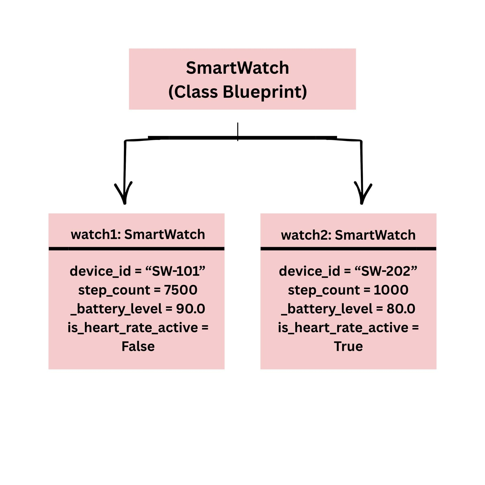

## Design Revision
No major changes were made to the overall concept. The property names were adjusted slightly to follow standard Python naming conventions, and batteryLevel was converted into a private attribute _battery_level to protect device power data from direct, invalid modifications.

| Attribute | Data Type | Visibility | Why Visibility? |
|---|---|---|---|
| device_ID | string | Public | Standard identifier that can be freely read by system modules |
| step_count | int | Public | General metric exposed to display widgets without restriction |
| _battery_level | double | Private | Protected to ensure power status is updated only through valid usage operations |
| isheart_rate_monitor | boolean | Public | Toggle flag that can be freely checked or modified by the interface |

## Updated UML
+-----------------------------------------------+
| SmartWatch                                    |
+-----------------------------------------------+
| + device_id : string                          |
| + step_count : int                            |
| - _battery_level : double                     |
| + is_heart_rate_active : boolean              |
+-----------------------------------------------+
| + log_steps(amount: int)                      |
| + toggle_heart_rate_monitor()                 |
| + get_battery_level() : double                |
+-----------------------------------------------+

## Object Diagram

## Analysis

# Why did you make your chosen attribute private?
I made _battery_level private to prevent external code from manually setting invalid values like continuous negative numbers or percentages over 100%. Protecting this attribute ensures that battery drain is updated strictly through operational logic like logging activity. Without encapsulation, unintended updates could break system calculations or crash user interface displays.

# Which method changes the state of your object?
The log_steps(amount: int) method directly modifies the internal state of the object. It increases step_count by adding the provided integer parameter and simultaneously decreases _battery_level relative to the activity amount. This reflects real-world hardware usage where running steps consumes battery capacity.

# How did your two objects demonstrate that instances are independent?
watch1 and watch2 demonstrated independence because executing watch1.log_steps(5000) only changed watch1's step count from 2500 to 7500 and reduced its battery from 95.0% to 90.0%. watch2 remained entirely unchanged with 1000 steps and 80.0% battery. This confirms each object maintains its own distinct memory allocation and state.

# What is the difference between your class diagram and your object diagram?
The class diagram serves as an abstract blueprint defining the general structure, attribute names, data types, and methods for any SmartWatch. In contrast, the object diagram represents specific, real instances in memory at a particular point in time, holding concrete values like device_id = "SW-101" and step_count = 7500. The class diagram shows what capabilities exist, while the object diagram shows what state exists right now.

## Run Test

