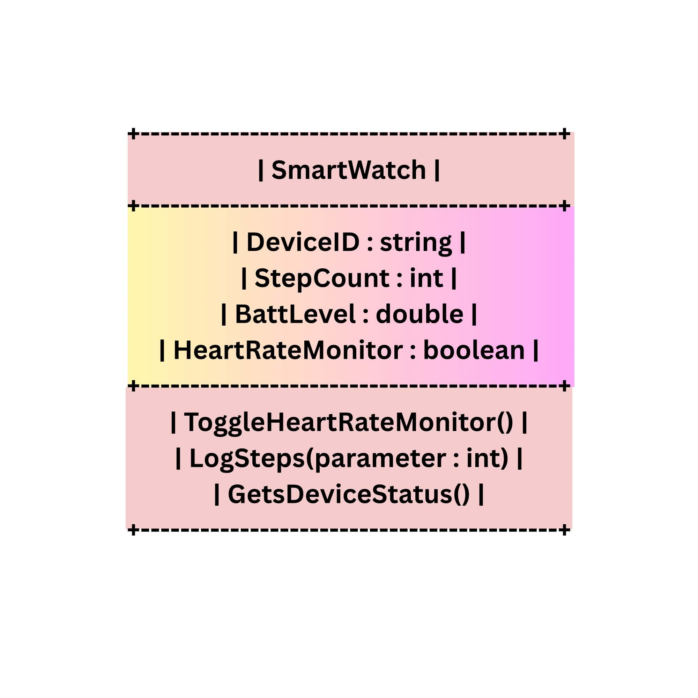

# SG4 - Understanding Classes and Objects
## Class Name: SmartWatch
## Class Description: This class represents a wearable smart fitness tracker and watch in a personal productivity system. It manages device settings, tracks physical activity, and monitors key health metrics in real time

## Properties
| Property | Data Type | Description |
|---|---|---|
| DeviceID | string | Identifier assigned to the smartwatch device |
| StepCount | int | Total number of steps recorded during the current day |
| BattLevel | double | Current battery percentage of the device |
| HeartRateMonitor | boolean | Indicates whether continous heart rate tracker is on or off |

## Methods
| Method | Description |
|---|---|
| ToggleHeartRateMonitor() | Shows the status of the HeartRateMonitor into true or false |
| LogSteps(parameter : int) | Adds the specified number of steps to the step count |
| GetsDeviceStatus() | It shows the current battery level of the watch and total steps of the user |

## Class Diagram

# Reflection Questions:
1. I chose Smart Watch class because wearable technology relies heavily on object-oriented concepts to manage multiple real-time sensors, hardware parameters, and user preferences within a single device.
2. I think it’s Device ID is the most important property. It acts as the unique primary identifier, and without a unique ID, a system could mix up metrics between different users or devices syncing to the same central database
3. The most useful method is Log Steps because tracking movement is the core feature of a fitness tracker.
