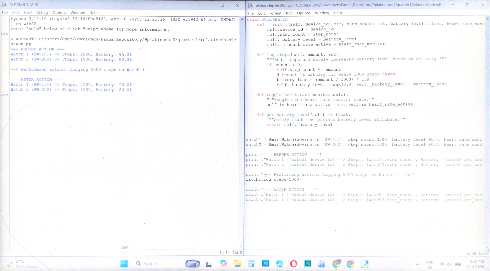

# Class Relationships: Association and Multiplicity
## Previous Work

[Part I - Classes and Objects](classObjectUML.md)

[Part II - Class Attributes and Methods](classAttributesMethods.md)

## Existing Class
Class: SmartWatch
Description: This class represents a wearable smart fitness tracker and watch in a personal productivity system. It manages device settings, tracks physical activity, and monitors key health metrics in real time.

## New Related Class
Class: UserAccount
Description: Represents a fitness platform user account that manages and aggregates health data across registered devices.

## Association
Relationship: UserAccount manages SmartWatch
Explanation: A UserAccount instance connects to, registers, and tracks data from one or more SmartWatch hardware instances owned by the user.

## Multiplicity
Multiplicity: One-to-Many
Explanation: One user account can manage zero or multiple smartwatches (e.g., daily wear vs. sport tracking). However, each individual smartwatch object is owned by exactly one primary user account in this system.

## UML Class Relationship Diagram)

## Python Implementation
[View Python Source](classImplementation.py)

## Test Run

## Object Relationship Diagram

## Analysis
### What is the association between your two classes?
The association is a HAS-A relationship where a UserAccount manages zero or more SmartWatch instances. The UserAccount serves as the central manager that links personal owner info to hardware data. The SmartWatch provides health metrics that the UserAccount reads and displays.

### What multiplicity did you choose and why?
I selected a one-to-many multiplicity because a single user account can logically register multiple fitness watches over time. Conversely, each physical watch unit is bound to exactly one specific account to maintain user data privacy.

### How did you implement the relationship in Python?
The relationship is implemented using the self.devices attribute within UserAccount, which starts as an empty list. The register_device(watch) method receives an actual SmartWatch object reference and appends it directly to self.devices.

### Why did you store an object reference instead of copying its data?
Storing an object reference ensures live data synchronization between connected components. If a device's battery drains or step count increases via watch1.log_steps(), the UserAccount automatically reflects those updates when calling display_connected_devices() without duplicating properties manually.

### If your relationship uses many, why is a list appropriate?
A Python list is ideal because it dynamic, allowing the system to grow or shrink the device collection dynamically without setting fixed size limits. The list stores memory addresses pointing directly to live SmartWatch instances, allowing iteration with a loop to invoke methods on each object.
